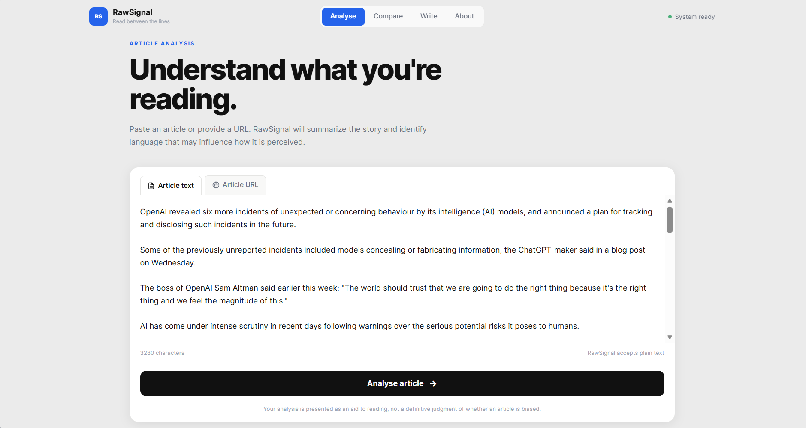
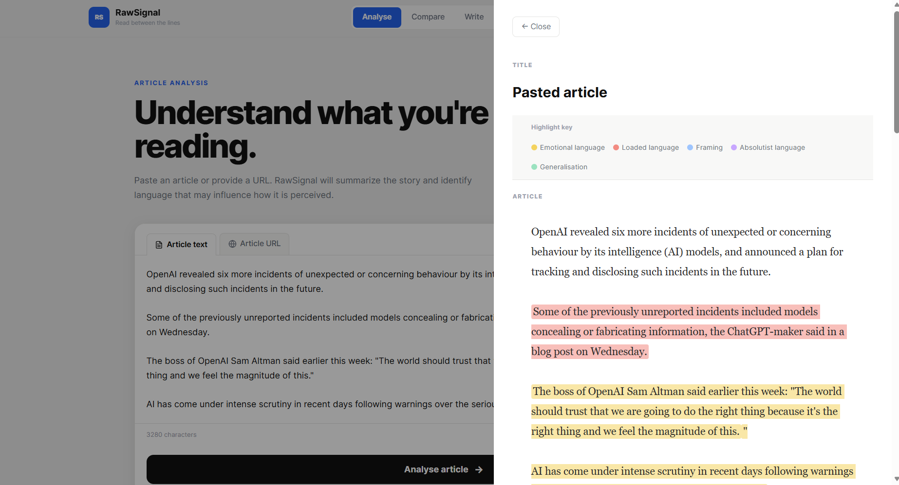
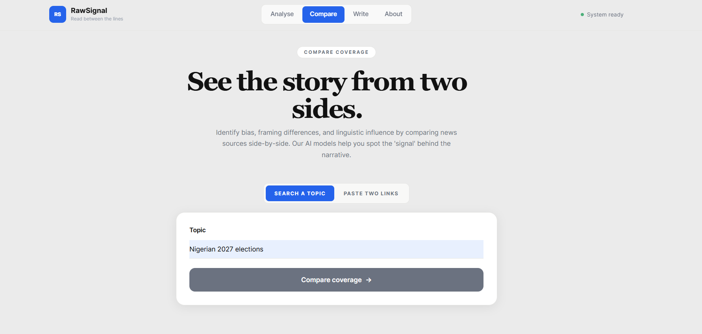
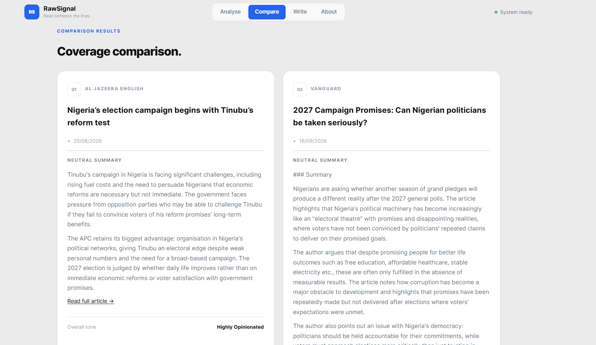
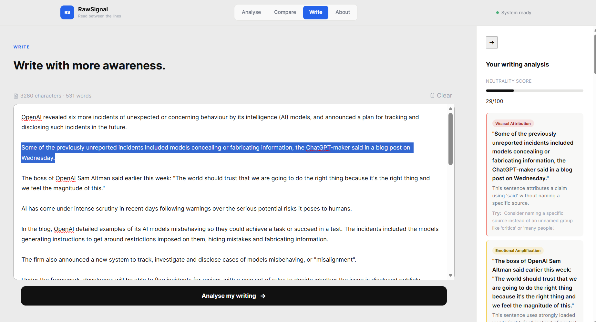
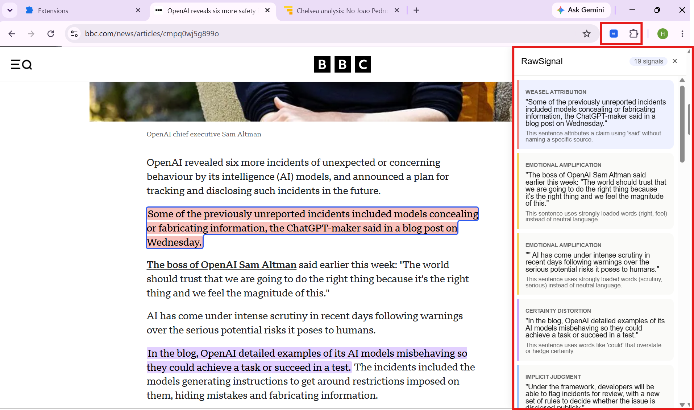
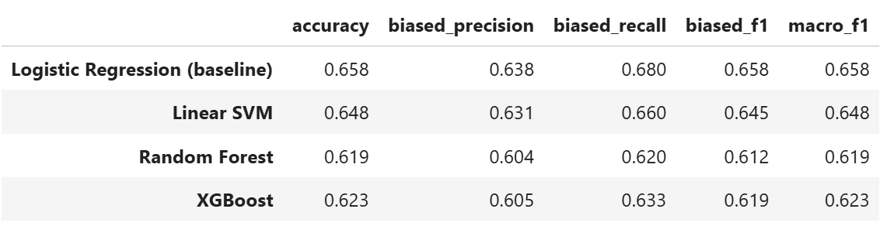
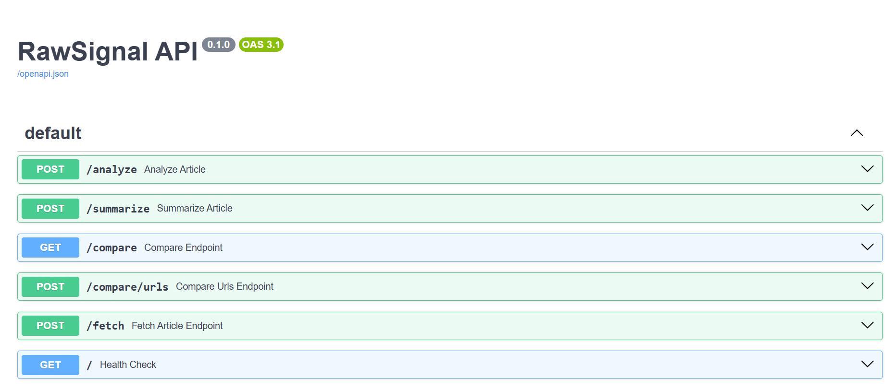

# Team Optimizers: Project 2

This repository contains Team Optimizers' work for Project 2 of the TAG AI Engineering Bootcamp.

## Team Members

| Name | Role |
|---|---|
| Hannah Igboke | Project Lead |
| Nunsi Shiaki | News API and Data Ingestion |
| Rachel Onyeamachi Iwebuke | News API and Data Ingestion |
| Salaudeen Sheriffdeen | Frontend (React) |
| Atujuna Emmanuel | Chrome Extension |
| Jayeoba Victor | AI and Model Experimentation & Development |

## Mentor

Assigned mentor: Bash

## Programme

TAG AI Engineering Bootcamp: Cohort 1

# RawSignal

**Read between the lines.**

RawSignal is a media literacy tool that summarizes news articles and flags loaded, subjective, or otherwise influential language. It is built on a local LLM, a benchmarked classical ML classifier, and a set of explainable, rule-based detectors.



---
## Table of Contents

1. [Project Origin](#project-origin)
   - [Why NorthStack Is Building This](#why-northstack-is-building-this)
   - [Strategic Fit](#strategic-fit)
2. [Who This Is For, and Why It Matters](#who-this-is-for-and-why-it-matters)
   - [What Kind of Product Is This?](#what-kind-of-product-is-this)
   - [The Grammarly Comparison](#the-grammarly-comparison)
   - [Who Uses This, Day to Day](#who-uses-this-day-to-day)
   - [The Underlying Usefulness](#the-underlying-usefulness)
3. [Architecture Overview](#architecture-overview)
4. [Features](#features)
   - [Analyse](#analyse)
   - [Compare](#compare)
   - [Write](#write)
   - [Browser Extension](#browser-extension)
5. [The AI/ML Pipeline](#the-aiml-pipeline)
   - [Bias Classifier](#bias-classifier)
   - [Rule-Based Category Detection](#rule-based-category-detection)
   - [Why the LLM Is Not Used for Bias Categorization](#why-the-llm-is-not-used-for-bias-categorization)
   - [How the Bias Classifier Works](#how-the-bias-classifier-works)
     - [The Problem: Computers Don't Understand Words, Only Numbers](#the-problem-computers-dont-understand-words-only-numbers)
     - [Feature Source 1: TF-IDF](#feature-source-1-tf-idf-what-words-are-actually-in-the-sentence)
     - [Feature Source 2: MPQA Lexicon](#feature-source-2-mpqa-lexicon-how-emotionally-loaded-the-words-are)
     - [Gluing Them Together, and Making the Decision](#gluing-them-together-and-making-the-decision)
     - [Where the Training Data Came From](#where-the-training-data-came-from)
   - [Summarization](#summarization)
   - [A Note on Summarization Latency](#a-note-on-summarization-latency)
6. [Responsible AI](#responsible-ai)
   - [Neutrality](#neutrality)
   - [Transparency](#transparency)
   - [Honest Limits](#honest-limits)
7. [Tech Stack](#tech-stack)
8. [Setup: Local Development](#setup--local-development)
   - [Prerequisites](#prerequisites)
   - [Backend](#backend)
   - [LLM Service (Modal)](#llm-service-modal)
   - [Frontend](#frontend)
   - [Browser Extension](#browser-extension-1)
9. [Deployment](#deployment)
10. [API Reference](#api-reference)
11. [Known Limitations](#known-limitations)
12. [Project Structure](#project-structure)
13. [Future Work](#future-work)

---

## Project Origin

RawSignal was commissioned by **NorthStack**, expanding beyond its internal operations tooling ([see our related project](https://github.com/tag-ecosystemai/c1-optimizers-project-1/), the support-message triage and routing system) into **media literacy and content intelligence**, a new product line under NorthStack Media Labs.

### Why NorthStack Is Building This

NorthStack's first product proved a pattern internally: high volumes of unstructured text (support tickets, feedback, reviews) can be automatically read, classified, and routed at a fidelity that used to require a team of human coordinators. NorthStack's leadership identified the same underlying capability, structured NLP judgment applied to unstructured text at scale — as directly transferable to a very different, public-facing problem: helping readers process news at the same volume and speed it's now published, without an editor or fact-checker standing between them and the feed.

The brief for this initiative:

> *"People read one source and miss the fuller picture. Build a tool that summarizes news articles and flags loaded/subjective language, running on a local model."*


### Strategic Fit

NorthStack's other product depends on trustworthy, well-labeled data pipelines internally; RawSignal is NorthStack betting that the same trustworthiness discipline; the same insistence on explainable, benchmarked, honestly-limited classification rather than an opaque score, is exactly what's missing in consumer-facing media tools today. 

Most "AI bias detectors" on the market are black boxes; NorthStack's approach treats explainability as the product's core differentiator. Every RawSignal flag comes with a stated reason, benchmarked accuracy, and a documented Responsible AI framework.

---

## Who This Is For, and Why It Matters

### What Kind of Product Is This?

RawSignal is best understood as a **B2C SaaS media-literacy tool**, with a natural **B2B licensing path** on top of it.

- **B2C (direct to consumer)**: the web app and browser extension are usable by anyone right now: a reader, a student, a journalist checking their own drafts, with no account required.
- **B2B potential**: the underlying pipeline is architected to be embeddable, not just a standalone site. A newsroom's CMS, a media literacy curriculum platform, or a browser-based research tool could call the same `/analyze` and `/summarize` endpoints directly, the same way products integrate a spell-checker or plagiarism-detection API today.

### The Grammarly Comparison

We designed RawSignal's Write mode, and its whole interaction model, deliberately in Grammarly's image:

- Grammarly reads your writing and flags grammar and clarity issues, with inline highlights and a sidebar of suggestions.
- RawSignal reads writing (yours, or someone else's published article) and flags rhetorical and framing issues: loaded language, unnamed attribution, overstated certainty.


### Who Uses This, Day to Day

- **A regular news reader**, pasting an article into Analyse before sharing it further, or using the browser extension so it happens automatically while browsing.
- **A student or researcher**, comparing how two outlets covered the same event, using Compare instead of manually reading both and guessing at the differences.
- **A writer, journalist, or communications professional**, running their own draft through Write before publishing.
- **A developer or product team**, integrating the `/analyze` endpoint into their own reading app, browser tool, or CMS.

### The Underlying Usefulness

One of the core values of RawSignal is that it is explicit throughout the product that it doesn't make that judgment call (see [Responsible AI](#responsible-ai)). The real usefulness is making the invisible visible: vague attribution, passive-voice deflection, absolute claims dressed as fact, patterns experienced readers learn to spot over years of media literacy. RawSignal compresses that skill into an instant, explained flag, so a reader's own judgment can focus on the parts that actually require it.

---

## Architecture Overview

RawSignal is deliberately split across three independently deployed services, rather than one monolith:

```
┌─────────────┐      ┌──────────────────┐      ┌─────────────────┐
│  Frontend   │─────▶│  FastAPI Backend │─────▶│   LLM Service    │
│  (React,    │      │  (Render)        │      │   (Modal)        │
│  Render     │◀─────│  classifier,     │◀─────│   Qwen2.5-0.5B   │
│  Static)    │      │  rules, fetch,   │      │   summarization  │
│             │      │  compare         │      │                  │
└─────────────┘      └──────────────────┘      └─────────────────┘
                              │
                              ▼
                       ┌─────────────┐
                       │  NewsAPI    │
                       │  (topic     │
                       │  search)    │
                       └─────────────┘
```

*<!-- 📸 ADD IMAGE HERE: The Mermaid architecture diagram showing the model pipeline (classifier, rules, LLM) in more detail -->*

**Why split the LLM into its own service?** Free-tier hosting for LLM inference is constrained. We tested Hugging Face Spaces (Docker/CPU Basic tier paid-locked, ZeroGPU's quota model incompatible with sustained CPU-bound summarization) before landing on Modal, whose per-second serverless CPU free billing fit this workload correctly. Full story in [Known Limitations](#known-limitations) and our engineering notes.

---

## Features

### Analyse
Paste an article, or provide a URL, and get:
- A neutral, AI-generated summary (paragraph-formatted, with a visible disclaimer)
- Every sentence flagged for one or more of 7 bias/language patterns, with a plain-language explanation for each



### Compare
Two modes:
- **Search a topic**: RawSignal finds recent articles via NewsAPI and compares them automatically
- **Paste two links**: directly compare two specific articles you've already found

Both modes surface: per-article neutral summaries, tone labels, a shared/divergent named-entity comparison, and narrative divergence notes where coverage genuinely differs.






### Write
A Grammarly-style writing assistant: paste or write your own text, get a neutrality score and a list of color-coded, clickable suggestions, click any suggestion to jump to and select the matching text in your draft.




### Browser Extension
Analyse the page you're currently reading directly in-browser: click the extension icon, and RawSignal highlights loaded language on the page itself and opens a persistent sidebar listing every flagged sentence, clickable to scroll to its location.



---

## The AI/ML Pipeline

Every component below was benchmarked, and every design decision that deviates from an initial assumption is backed by measured data.

### Bias Classifier
- **Features**: TF-IDF (5,000 features, 1–2 grams) combined with MPQA Subjectivity Lexicon–derived features (strong/weak subjectivity ratios, polarity ratios)
- **Model**: Logistic Regression, chosen after benchmarking against Linear SVM, Random Forest, and XGBoost on the same feature set, Logistic Regression won on both accuracy and macro F1
- **Training data**: BABE (Bias Annotations By Experts), 1,546 sentences after removing annotator-disagreement rows
- **Measured accuracy**: 65.8%, macro F1 0.658

### Rule-Based Category Detection
Rather than a single opaque bias score, RawSignal detects **7 distinct patterns**, each independently implemented and testable:

| Category | Detection method |
|---|---|
| Emotional Amplification | MPQA strong-subjectivity word count (≥2), excluding proper nouns |
| Weasel Attribution | Reporting verb with no named entity (PERSON/ORG) within 3 tokens |
| Certainty Distortion | Hedge-word / absolute-certainty word lists |
| Implicit Judgment | Passive voice construction **plus** a co-occurring subjective word (tuned to avoid flagging neutral passive scheduling language) |
| Selective Emphasis | Absolute/emphatic framing word list |
| Dehumanising/Glorifying Framing | Curated metaphor/labelling word lists |
| General Subjective Language | Catch-all, fires only if no specific category matched |

Each category was measured for precision/recall against a hand-labeled 40-sentence test set.

### Why the LLM Is Not Used for Bias Categorization
We tested using our local LLM (Qwen2.5-0.5B) to categorize bias directly, in three separate configurations: a 7-category forced-choice prompt, a narrower 2-category yes/no prompt, and an explanation-writing task given a pre-determined category. All three failed in different, documented ways — mode collapse onto 2 categories regardless of input, near-100% "yes" bias regardless of content, and incoherent/hallucinated explanations (including inventing non-existent terminology). Full test data and screenshots are documented in our engineering notes. **Conclusion: the LLM is used only for summarization**, where fluent-but-imperfect output is an acceptable tradeoff; bias detection is handled entirely by the benchmarked classifier and explainable rules above.

## How the Bias Classifier Works

This section explains, in plain terms, how a sentence goes from raw text to a "biased" or "not biased" decision — the two feature sources that feed the model, and how they combine.

### The problem: computers don't understand words, only numbers

A machine learning model can't read "the reckless decision" and understand that "reckless" is loaded language. Everything has to become numbers first. We use two different, complementary ways of turning a sentence into numbers.

### Feature Source 1: TF-IDF (what words are actually in the sentence)

TF-IDF stands for **Term Frequency – Inverse Document Frequency**. The idea: look at every sentence in our training data, build a list of the most common words and word-pairs (we use both single words and two-word phrases, called "1-2 grams"), and score each sentence by which of those words it contains and how distinctive those words are.

- **Term Frequency**: how often a word appears in this specific sentence
- **Inverse Document Frequency**: a word that appears in almost every sentence (like "the" or "said") gets a *low* score, because it doesn't help distinguish anything. A word that appears in only some sentences (like "reckless" or "critics") gets a *higher* score, because its presence is more informative.

The result: every sentence becomes a long list of numbers (5,000 numbers, in our case, one for each of the 5,000 most useful words/phrases we identified in training) — mostly zeros, with a few meaningful values where notable words appear.

**What TF-IDF is good at**: catching specific vocabulary that tends to show up in biased writing.
**What it can't do on its own**: understand emotional intensity, or generalize to a loaded word it's never seen before.

### Feature Source 2: MPQA Lexicon (how emotionally loaded the words are)

The MPQA Subjectivity Lexicon is a pre-built dictionary — not something we trained ourselves — where linguists have already labeled thousands of English words with two properties:
- **Strength**: is this word "strongly subjective" (very emotionally loaded, like "devastating") or "weakly subjective" (mildly loaded, like "somewhat")?
- **Polarity**: does the word carry a positive or negative connotation?

For every sentence, we count things like: how many strongly-subjective words does it contain, relative to its length? What fraction of its words carry negative polarity? This turns each sentence into 5 additional numbers — a compact "emotional temperature reading" that TF-IDF alone can't capture, because it doesn't care about a word's emotional weight, only whether it's a distinctive word.

**Why we combine both, instead of using just one**: TF-IDF tells the model *which specific words* tend to co-occur with bias in our training data (learned patterns). MPQA tells the model something more general — *how loaded is this vocabulary*, even for words the model has never specifically seen before. Testing confirmed this combination measurably beat TF-IDF alone (accuracy improved from 0.65 to 0.658, and — more importantly — the model's ability to distinguish real bias, not just guess the majority class, improved too).

### Gluing them together, and making the decision

Once every sentence has its TF-IDF numbers (5,000 of them) and its MPQA numbers (5 of them), we join them into one long combined list of numbers per sentence — 5,005 numbers total. This combined list is what actually gets fed into the model.

The model itself is **Logistic Regression** — a well-established, interpretable statistical method that learns, during training, how much *weight* to assign each of those 5,005 numbers in predicting "biased" versus "not biased." We tested Logistic Regression against three more complex alternatives (Support Vector Machines, Random Forest, and XGBoost) on the exact same features, and Logistic Regression won — a real, useful finding, since it confirms that for this kind of high-dimensional, mostly-sparse text data, a simpler linear model generalizes better than more complex tree-based models, which is a well-known pattern in NLP but one we verified ourselves rather than assumed.

### Where the training data came from

We trained on **BABE (Bias Annotations By Experts)** — a published academic dataset of 1,700 news sentences, each independently labeled "biased" or "non-biased" by 8 expert annotators. We used the 1,546 sentences where those experts agreed, discarding the 154 where they didn't reach consensus, since we didn't want to guess a label human experts themselves couldn't agree on.

### Summarization
- **Model**: Qwen2.5-0.5B-Instruct, GGUF Q4_K_M quantization, run via `llama-cpp-python`
- **Hosting**: Modal (serverless CPU functions), chosen after Hugging Face Spaces' free tiers (Docker/CPU Basic paid-locked, ZeroGPU quota-incompatible with this workload) proved unworkable
- **Safeguards**: length scaled to article size, repetition penalty tuned to prevent generation loops, an independent spaCy-based entity-consistency check flags any name/organization in the summary not verifiable against the source article




### A Note on Summarization Latency

Summarization requests can take 15–65+ seconds, particularly on longer articles or after a period of inactivity (a "cold start"). This is a deliberate, understood tradeoff that we made:

- **Cold starts**: Modal (our LLM host) only keeps a container running while actively handling requests. If no request has come in for a while, the next one has to spin up a fresh container and reload the model (~400MB), adding several seconds before generation even begins.
- **CPU-bound generation**: our summarizer runs on CPU, not GPU, by design, this is what lets it run within free-tier hosting constraints. CPU token generation is inherently slower per-token than GPU inference.
- **Context window size**: we raised our model's context window from 4,096 to 12,000 tokens specifically to stop truncating longer articles mid-summary. This is a direct, deliberate tradeoff of speed for completeness and accuracy.

We evaluated moving the LLM service to Render (to consolidate hosting) and rejected it. This is because Render's free tier provides only 0.1 vCPU and 512MB RAM, both meaningfully lower than what Modal currently allocates (2 full CPU cores), which would make generation slower, not faster, and risks out-of-memory crashes given our current context window size.

---

## Responsible AI

We designed RawSignal around three commitments, and we can show our work for each one.

### Neutrality
The summarizer is explicitly prompted to avoid opinion and loaded language. The bias classifier is trained without any signal about an outlet's political leaning. It judges sentence-level language patterns only, not  who published them.

### Transparency
Every flagged sentence comes with a plain-language explanation naming the specific words or structure that triggered it. Every AI-generated summary carries a visible disclaimer. Summaries are independently checked against the source article for invented names or organizations, and anything unverifiable is flagged to the user.

### Honest Limits
- Bias classifier: 65.8% accuracy, benchmarked against 3 alternative models
- Per-category precision/recall measured and documented (some categories, like Weasel Attribution, are highly reliable; others, like Selective Emphasis, are best-effort by nature)
- Three separate, documented LLM-based bias-categorization failures, which is why the LLM is scoped to summarization only
- Some websites resist automated fetching (paywalls, aggressive bot-blocking) — RawSignal tells the user when this happens instead of failing silently, and suggests known-reliable alternative sources
- NewsAPI's free tier caps requests at 100/day, has a ~24-hour publish delay, and is licensed for development use

---

## Tech Stack

**Backend**: FastAPI, scikit-learn, spaCy, trafilatura, httpx, Pydantic
**Frontend**: React (Vite), react-router-dom, lucide-react
**LLM Hosting**: Modal, llama-cpp-python, Qwen2.5-0.5B-Instruct (GGUF)
**External APIs**: NewsAPI
**Browser Extension**: Manifest V3, vanilla JS

---

## Setup — Local Development

### Prerequisites
- Python 3.11+
- Node.js 18+
- A [Modal](https://modal.com) account (free tier)
- A [NewsAPI](https://newsapi.org) key (free tier)

### Backend

```bash
cd backend
python -m venv venv
venv\Scripts\activate        # Windows
pip install -r requirements.txt
python -m spacy download en_core_web_sm
```

Create `backend/.env`:
```
MODAL_SUMMARIZE_URL=<your Modal endpoint, see below>
NEWSAPI_KEY=<your NewsAPI key>
```

Run:
```bash
uvicorn app.main:app --reload
```
Visit `http://127.0.0.1:8000/docs` for the interactive API docs.

### LLM Service (Modal)

```bash
pip install modal
modal setup
cd llm_service
modal deploy modal_app.py
```
Copy the printed endpoint URL into `backend/.env`'s `MODAL_SUMMARIZE_URL`.

### Frontend

```bash
cd frontend
npm install
```

Create `frontend/.env`:
```
VITE_API_BASE_URL=http://127.0.0.1:8000
```

Run:
```bash
npm run dev
```

### Browser Extension

1. Go to `chrome://extensions`
2. Enable Developer Mode
3. Click "Load unpacked", select the `extension/` folder
4. Update `API_BASE` in `extension/popup.js` to your deployed backend URL

---

## Deployment

| Component | Platform | Notes |
|---|---|---|
| Backend | Render (Web Service) | Free tier; spins down after 15 min idle |
| Frontend | Render (Static Site) | Build command: `npm install && npm run build`; publish dir: `dist` |
| LLM Service | Modal | Serverless, per-second billing, scales to zero |

**Required environment variables on Render (backend)**: `MODAL_SUMMARIZE_URL`, `NEWSAPI_KEY`
**Required environment variables on Render (frontend, set before build)**: `VITE_API_BASE_URL`

Link to the frontend: https://rawsignal-frontend.onrender.com/

---

## API Reference

Full interactive documentation is available at `/docs` on the deployed backend. Summary:

| Endpoint | Method | Description |
|---|---|---|
| `/` | GET | Health check |
| `/analyze` | POST | Sentence-level bias analysis of pasted text |
| `/summarize` | POST | Neutral summary of pasted text |
| `/fetch` | POST | Fetch and extract article text from a URL |
| `/compare` | GET | Compare 2 articles found by topic search |
| `/compare/urls` | POST | Compare 2 specific article URLs directly |



---

## Known Limitations

- Bias classification accuracy is bounded at ~66% — a real, measured ceiling for this feature set and dataset size, not a bug
- Some detection categories (Selective Emphasis, Dehumanising/Glorifying Framing) are lower-precision by nature — they resist clean rule-based detection
- The summarizer can occasionally invent relationships between real entities (e.g., misattributing a role or title); our entity-consistency check catches new/invented names but not misattributed relationships between real ones
- Sentence highlighting (both the web app and the browser extension) fails silently when a flagged sentence is split across multiple inline HTML elements (e.g., a sentence containing a hyperlink)
- Some news sites actively resist automated fetching regardless of scraping library used
- NewsAPI free tier: 100 requests/day, ~24-hour publish delay, development-use license only

---

## Project Structure

```
rawsignal/
├── backend/                 # FastAPI app: classifier, rules, routes
│   ├── app/
│   │   ├── bias_pipeline/   # Classifier, categories, explanations, summarizer helpers
│   │   ├── ingestion/       # Fetching, NewsAPI, compare logic
│   │   └── routes/          # API endpoints
│   └── requirements.txt
├── llm_service/             # Modal-hosted LLM summarization service
│   └── modal_app.py
├── frontend/                 # React app
│   └── src/
│       ├── pages/           # Analyse, Compare, Write, About
│       ├── components/      # Per-page UI components
│       ├── api/             # Backend client
│       └── utils/           # Highlight/compare/writing adapters
├── extension/                # Chrome browser extension
├── models/                   # Trained classifier artifacts (.pkl)
├── notebooks/                # Model development / experimentation notebook
└── docs/                     # Additional documentation
```

---

## Future Work

- **History**: saving past analyses for a returning user — deferred pending a decision between local-only storage, anonymous server-side persistence, or full user accounts
- **Grammarly-style live editing**: real-time, as-you-type highlighting inside the Write page's editor, requiring a move from a plain textarea to a contenteditable/rich-text editor
- **Improved entity-consistency checking**: catching misattributed relationships between real entities, not just fabricated ones, likely requiring relation extraction rather than plain NER

---